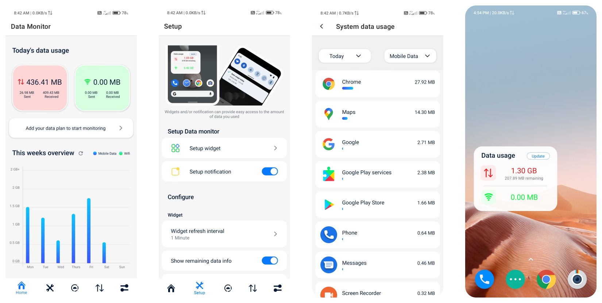
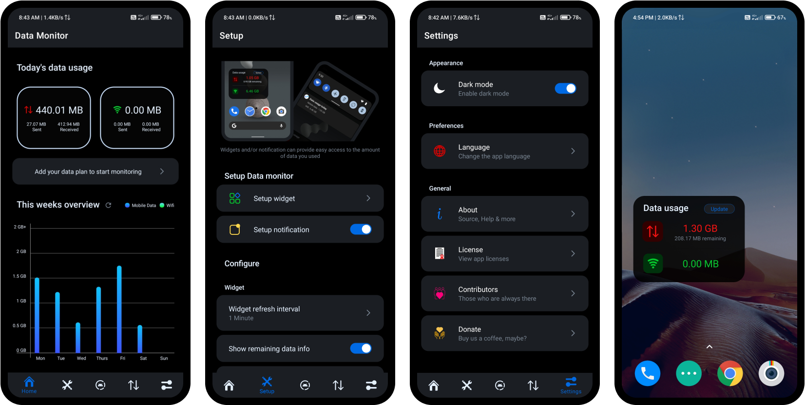

</img>

# Data Monitor
Track all your data usage - at one place

## Features
- Track daily data usage
- App-wise data usage stats
- Stats for different time period (last month, this year, all time etc).
- Mobile data as well as Wifi usage stats
- Weekly data usage overview
- Data Monitor widget and notification
- Data usage alert
- Custom mobile data reset time
- No ads or In-app purchases
- Light-weight and Open Source

## Screenshots
  

  

## Download
Check <a href = "">releases</a>

## License
Check app license <a href = "LICENSE">here</a>

## Contribute
Click <a href = "CONTRIBUTING.md">here</a> to learn how to contribute.

## XDA Thread
Check xda thread <a href = "https://forums.xda-developers.com">here</a>.